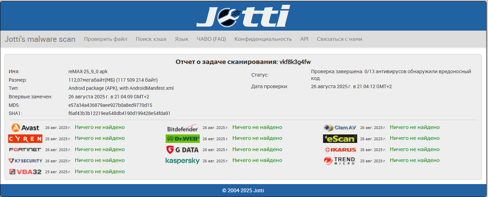
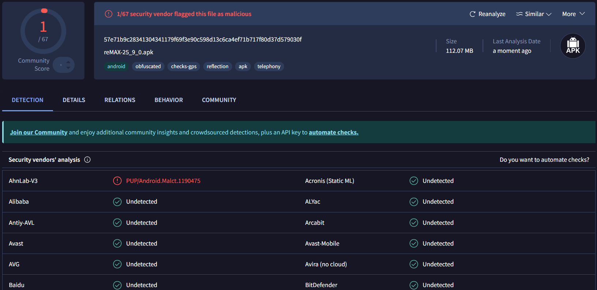
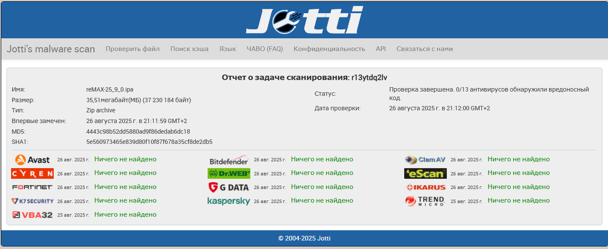
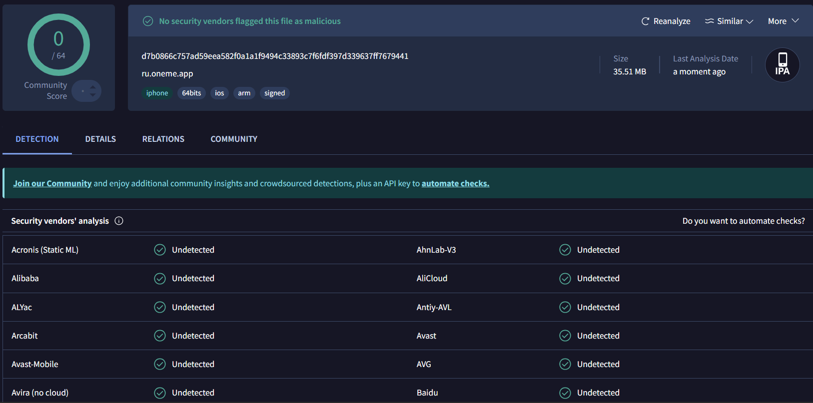

<p align="center">
  
</p>

# <center>**reMAX Mod**</center>


[](https://github.com/remax-mod/remax/releases)
[](LICENSE)
[](https://t.me/remaxmod)

Данный мод представляет собой модифицированную версию приложения MAX, разработанную с целью повышения конфиденциальности и безопасности пользователя.

> [!WARNING]  
> Обратите внимание, мод специализируется **ТОЛЬКО** на отключении разрешений, трекеров и других подобных вещах. То есть информация, которую вы отправляете в данный мессенджер, всё ещё не анонимна. Используйте приложение с умом.

## Метаданные приложений

*   **Версия:** 25.9.0
*   **Платформы:**
    *   **Нативно:** Android (минимальная версия 10), iOS (минимальная версия 15.4)
    *   **Транслятор:** Windows (7 и выше)

## Проделанная работа

*   [x] Разобраны и проанализированы установочные пакеты
*   [x] Убраны подозрительные разрешения
*   [x] Убраны трекеры активности
*   [x] Убран автозапуск
*   [x] Убрана работа в фоновом режиме
*   [x] Выключены fingerprint функции

| Параметр                                         | MAX | Другие моды | **reMAX Mod** |
| :----------------------------------------------- | :--------------: | :---------: | :------------------------------------------ |
| Отключены инвазивные разрешения                  |        ❌        |      ✅     | ✅                                          |
| Удалены/Отключены трекеры активности             |        ❌        |      ❌     | ✅                                          |
| Отключен автозапуск                              |        ❌        |      ❌     | ✅                                          |
| Отключена фоновая активность                     |        ❌        |      ❌     | ✅                                          |
| Блокировка функций снятия отпечатков устройства  |        ❌        |      ❌     | ✅                                          |
| Блокировка/перенаправление сетевых запросов и трафика |        ❌        |      ❌     | ✅                                          |
| Кроссплатформенность                             |        ✅        |      ❌     | ✅                                          |

## Подробные отчёты работы

*   [Подробный отчёт для Android](reports/README_android_detailed.md)
*   [Подробный отчёт для iOS](reports/README_ios_detailed.md)
*   [Подробный отчёт для Windows](reports/README_windows_detailed.md)

## Антивирусы

### Android (APK)
<details>
<summary>Jotti's malware scan</summary>

</details>
<details>
<summary>VirusTotal scan</summary>


> [!INFO]  
> Внимание! PUP/Android.Malct.1190475 — это 100% не вирус, а всего лишь потенциально нежелательное приложение (мод). Оно не наносит вреда устройству и не содержит вредоносных функций. Антивирус предупреждает из-за модификаций или нестандартных функций, но это не угроза безопасности. Можно спокойно использовать, если уверены в источнике файла. 
> [](https://www.malwarebytes.com/ru/cybersecurity/basics/what-is-pup)


</details>

### iOS (IPA)
<details>
<summary>Jotti's malware scan</summary>

</details>
<details>
<summary>VirusTotal scan</summary>

</details>

## Инструкция по установке

1.  Удалите оригинальный MAX.
2.  Скачайте установочный собранный файл из [Releases](https://github.com/remax-mod/remax/releases) под свою систему.
3.  Установите пакет (для iOS рекомендуем использовать [Sideloadly!](https://sideloadly.io)).

Готово!

## Сотрудничество

Мы используем лицензию [GPL-3.0](https://github.com/remax-mod/remax?tab=GPL-3.0-1-ov-file). Мы готовы к сотрудничеству, смело исследуйте исходники, находите баги и уязвимости и пишите исправления в [https://github.com/remax-mod/remax/pulls](https://github.com/remax-mod/remax/pulls). Также мы будем рады, если вы создадите свой fork.

## Упоминание

```bibtex
@software{ehristoforu_reMAX_Mod_2025,
  author = {ehristoforu},
  month = aug,
  title = {{reMAX Mod}},
  url = {https://github.com/remax-mode/remax},
  year = {2025}
}
```

## Отказ от Ответственности

Данная модифицированная версия приложения MAX создана исключительно в исследовательских и образовательных целях для демонстрации методов повышения конфиденциальности мобильных приложений. Мы не претендуем на оригинальность приложения и не несем никакой ответственности за его дальнейшее использование, распространение или любые последствия, связанные с ним. Пользователь несет полную ответственность за любые действия, предпринятые с этой модифицированной версией.
